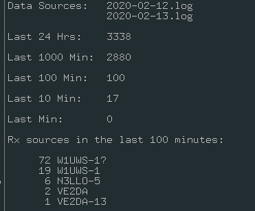

# direwolf-rx-counts
Bash script that displays the number of packets received by [Dire Wolf](https://github.com/wb2osz/direwolf)

Output of script:

This script uses the following commands in Bash 5.0.11:
* ls
* head
* tail
* awk
* sort
* uniq
* wc
* printf
* seq

And the following bash script:
* [spark](https://github.com/holman/spark)
