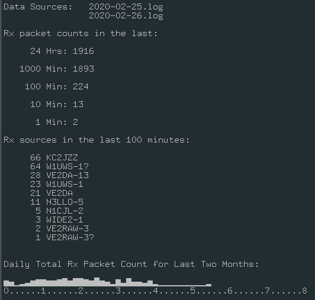

# direwolf-rx-counts
Bash script that displays the number of packets received by [Dire Wolf](https://github.com/wb2osz/direwolf)

Output of script:

This script requires:
* [head](https://en.wikipedia.org/wiki/Head_(Unix))
* [awk](https://en.wikipedia.org/wiki/AWK)
* [wc](https://en.wikipedia.org/wiki/Wc_(Unix))
